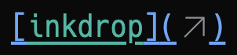

# link-compact


`link-compact` is an Inkdrop plugin for Inkdrop that automatically compacts the URL part of Markdown links when you open a note. You can toggle the compact view in the active editor with a `link-compact:toggle` command.

* https://my.inkdrop.app/plugins/link-compact
* https://github.com/basyura/inkdrop-link-compact

## Features

- Replaces the URL part of Markdown links with a subtle upper-right SVG arrow by default
- Lets you customize the replacement character in Inkdrop plugin settings

## Screenshots

Original Markdown


With Default Settings



With Custom Settings


## Requirements

- Inkdrop v6 or later

## Installation

Install `link-compact` from Inkdrop's plugin manager.

## Commands

- `link-compact:toggle`
  - Toggles compact display for Markdown link URLs in the active editor


## Configuration

- `link-compact.linkEmoji`
  - Character shown in place of the hidden URL
  - Default: empty (upper-right SVG arrow)
- `link-compact.notelinkEmoji`
  - Character shown in place of hidden `inkdrop://` note link URLs
  - Default: empty (upper-right SVG arrow)
- `link-compact.imglinkEmoji`
  - Character shown in place of hidden image link URLs
  - Default: empty (upper-right SVG arrow)

Leave a setting blank to use the arrow, or enter an emoji or other text to use it instead.
Each link type is configured independently. Previously saved emoji settings are preserved;
clear them to use the arrow.

## Styling compact links

When compact display is enabled, the plugin adds the `link-compact-enabled` class to the editor.
The following sample makes Markdown link syntax less visually prominent while compact display is enabled.
Add it to your Inkdrop `Styles.css`:

```css
.link-compact-enabled .md-link-mark {
  color: rgba(119, 204, 189, 0.3);
  color: black !important;
  font-size: 5pt;
  margin-left: -2px;
}
```

or

```css
.link-compact-enabled .md-link-mark {
  display: none;
}
```

When compact display is disabled, the class is removed and the rule no longer applies.

## Rendered HTML

When compact display is enabled, the URL part of a Markdown link is replaced with a non-editable `span`.
The original URL remains in the Markdown document and is stored in the `data-url` attribute.

With the default empty setting, `https://www.inkdrop.app` is rendered as:

```html
<span class="link-compact-mark" contenteditable="false"
      data-url="https://www.inkdrop.app">
  <svg viewBox="0 0 24 24" width="1em" height="1em"
       aria-hidden="true" focusable="false">
    <path fill="none" stroke="currentColor" stroke-linecap="round"
          stroke-linejoin="round" stroke-width="1.5"
          d="M3.84 20.25 19.75 4.34M19.75 19.34v-15h-15"></path>
  </svg>
</span>
```

With `🌐` explicitly configured, it is rendered as:

```html
<span class="link-compact-mark" contenteditable="false"
      data-url="https://www.inkdrop.app">🌐</span>
```

## Attribution

This project is a maintained and republished fork of `shagon94/short-link`, originally released under the MIT license and updated for Inkdrop v6.

## Changelog

* https://github.com/basyura/inkdrop-link-compact/commits/master/
